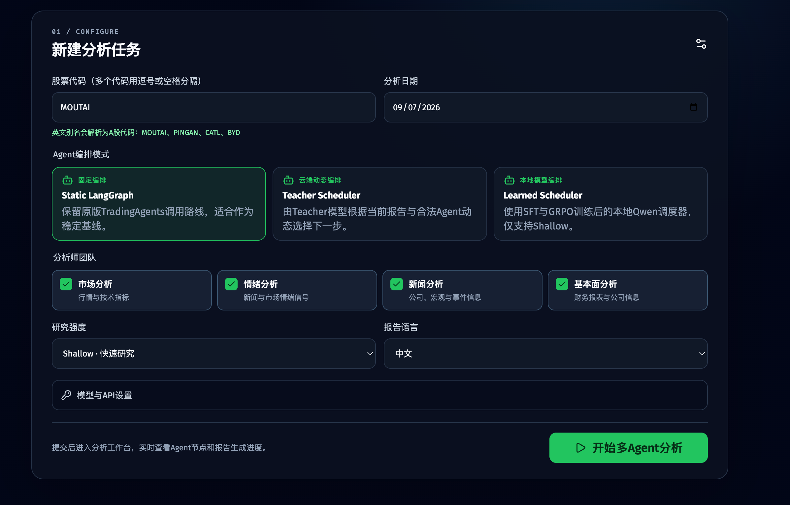
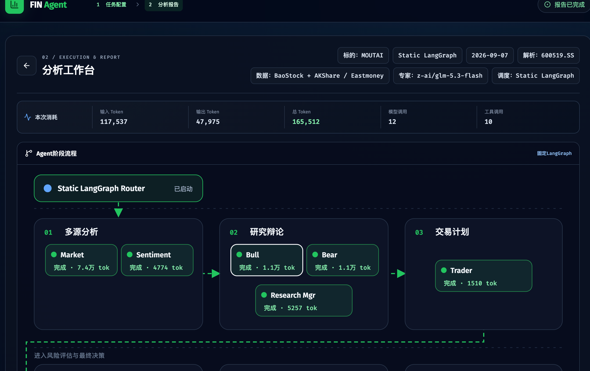
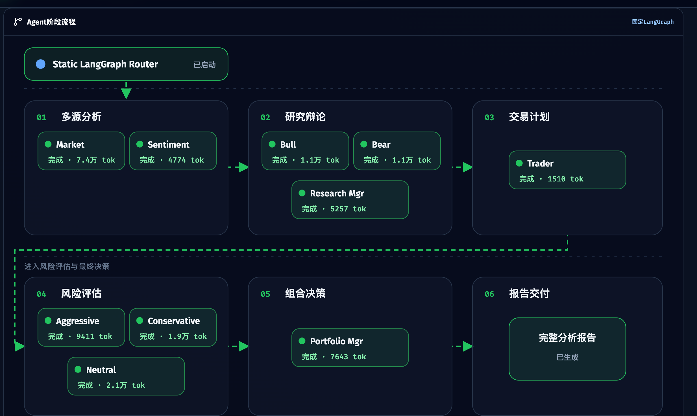
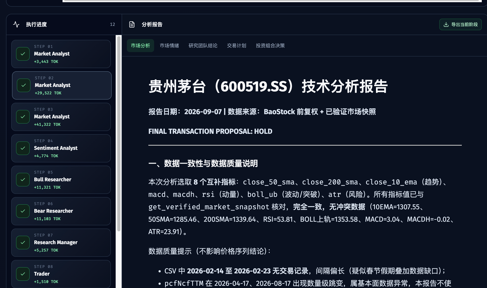
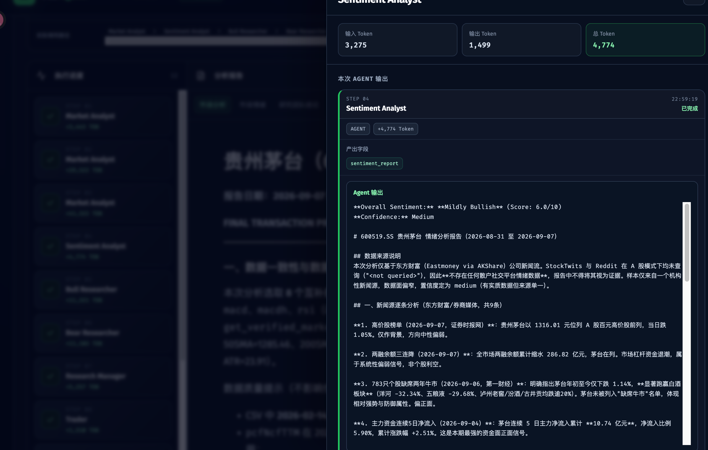
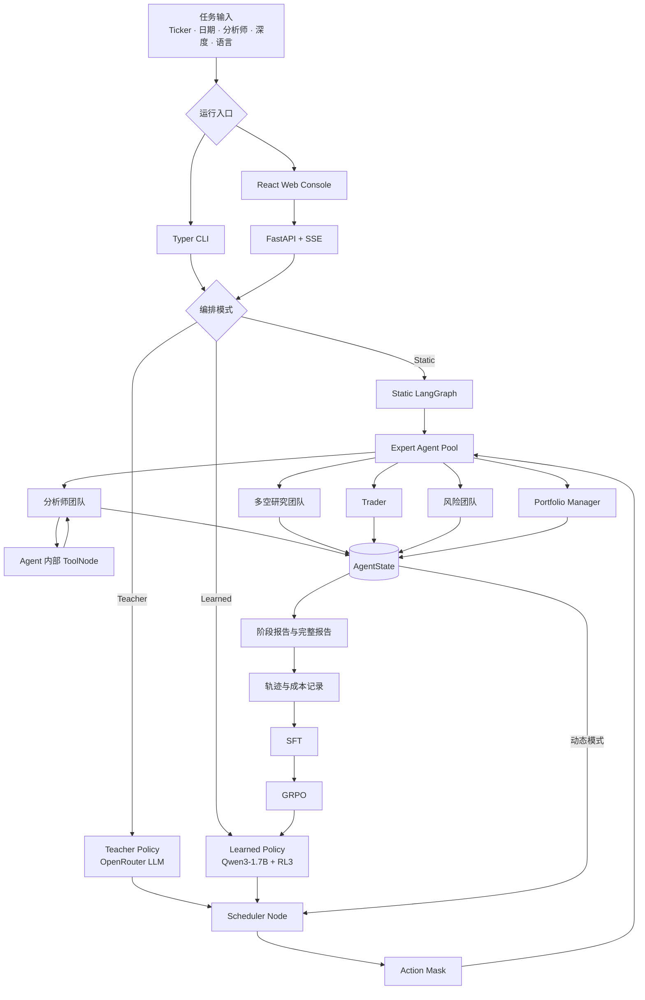

# FIN Agents

FIN Agents 是一个面向金融分析任务的多 Agent 动态编排系统。系统通过 12 个专业 Agent 完成
市场研究、多空辩论、交易计划、风险评估和组合决策，并提供 Static、Teacher、Learned 三种
编排模式。

项目的核心不是训练新的金融专家，而是训练一个小模型 Scheduler：专家 Agent 及其内部工具保持
不变，由 Scheduler 根据当前状态动态决定下一步调用哪个 Agent，以及何时结束任务。

## 项目目标与结果

项目解决固定工作流对不同任务执行相近调用路径的问题。通过轨迹采集、SFT 和 GRPO，将 Agent
调用顺序建模为受约束的离散决策过程，使本地 Scheduler 能在合法 Agent 集合中动态选择下一步。

### A/B/C 分层评测集

评测任务按模型是否在 SFT、RL 阶段见过划分为三个层级：

| 评测集 | 任务类型 | 目的 |
| --- | --- | --- |
| A | SFT 阶段见过 | 验证基础流程学习与稳定执行能力 |
| B | SFT 未见、RL 阶段见过 | 验证强化学习阶段对新任务的适应能力 |
| C | SFT 与 RL 均未见 | 验证真正未见任务上的编排泛化能力 |

### 核心评测结果

| 模型 | 完成任务 | 自动质量均值 | 成功任务平均 Token |
| --- | ---: | ---: | ---: |
| Static | 24/24 | 0.652 | 120.7k |
| SFT-6 | 24/24 | 0.694 | 104.4k |
| **RL3** | **24/24** | **0.729** | **92.7k** |
| RL5 | 24/24 | 0.685 | 112.3k |

RL3 的实际效果：

- 相对 Static，Learned Scheduler 的平均 Token 消耗降低约 **23.2%**；
- 相对 SFT-6，成功任务平均 Token 从 104.4k 降至 92.7k，降低约 **11.2%**；
- 相对 SFT-6，自动质量均值从 0.694 提升至 0.729，相对提升约 **5.0%**；
- 相对 Static，自动质量均值从 0.652 提升至 0.729，绝对提高 0.077，相对提升约 **11.8%**；
- 相对 RL5，RL3 的平均 Token 消耗降低约 **17.5%**，自动质量均值提升约 **6.4%**；
- Static、SFT-6、RL3、RL5 均完成 **24/24** 个评测任务，完成率均为 **100%**；
- 已记录 Scheduler 动作合法率为 **100%**。

### 结论

RL3 在 24 个评测任务上保持 100% 完成率，同时取得四个版本中最高的自动质量均值和最低的平均
Token 消耗。RL5 同样完成全部任务，但质量分低于 RL3，平均 Token 消耗也更高。因此项目最终选择
**RL3** 作为本地 Learned Scheduler 的部署版本。

## 提供的功能与服务

| 功能 | 说明 |
| --- | --- |
| 多 Agent 金融分析 | 根据股票、日期和分析师组合生成完整投资研究报告 |
| 三模式编排 | 支持 Static LangGraph、Teacher Scheduler、Learned Scheduler |
| 动态 Agent 调度 | 根据 AgentState、历史动作和合法动作集合选择下一 Agent |
| 多市场数据接入 | 支持 A 股、国际股票与加密资产；A 股优先使用中国数据源 |
| 实时分析工作台 | 动态展示 Agent 进度、单 Step 输出、失败节点和 Token 消耗 |
| 分阶段报告 | 输出市场、情绪、新闻、基本面、研究、交易和组合决策报告 |
| 报告导出 | 支持单独导出当前阶段报告和完整 Markdown 报告 |
| 本地模型推理 | 使用 Qwen3-1.7B 与 RL3 LoRA Adapter 执行 Learned Scheduler |
| 任务恢复 | 页面关闭后重新连接运行中任务，并支持可选节点 checkpoint |
| CLI 与 Web 服务 | 同时提供终端交互入口和 FastAPI + React Web 页面 |

## 界面预览

### 任务配置



### 分析工作台



### Agent 阶段流程



### 阶段报告



### 单 Step Agent 输出



## 启动与访问

在 FIN Agents 项目根目录执行命令。首次运行先创建 Python 3.12 环境并安装 Web 依赖：

```bash
cd /path/to/FINAgents
python3.12 -m venv .venv
source .venv/bin/activate
pip install -e ".[web]"

npm --prefix web/frontend install
npm --prefix web/frontend run build
cp .env.example .env
```

如果要运行本地 Learned Scheduler，再安装模型推理依赖：

```bash
pip install -e ".[web,scheduler-train]"
```

在本地 `.env` 中配置模型供应商密钥和模型名称，然后启动服务：

```bash
.venv/bin/tradingagents-web
```

服务默认监听本机 `127.0.0.1:8000`：

- 分析工作台：[http://127.0.0.1:8000](http://127.0.0.1:8000)
- 健康检查：[http://127.0.0.1:8000/api/health](http://127.0.0.1:8000/api/health)
- OpenAPI：[http://127.0.0.1:8000/docs](http://127.0.0.1:8000/docs)

CLI 模式从同一个项目和 `.env` 启动：

```bash
.venv/bin/tradingagents
.venv/bin/tradingagents --orchestration-mode static
.venv/bin/tradingagents --orchestration-mode teacher
.venv/bin/tradingagents \
  --orchestration-mode learned \
  --scheduler-base-model /path/to/Qwen3-1.7B \
  --scheduler-adapter-path /path/to/RL3/checkpoint
```

Web 页面可直接选择 Static、Teacher 或 Learned。Learned 模式需要本地 Qwen3-1.7B 基模和 RL3
LoRA Adapter；Static 与 Teacher 不读取本地 Scheduler Adapter。

### Learned Docker 镜像

`Dockerfile.learned` 会把 Qwen3-1.7B 基模和 RL3 Adapter 复制进镜像。默认从以下本地目录读取：

```text
dist/autodl-scheduler/models/Qwen3-1.7B
artifacts/scheduler/qwen3-1p7b/grpo-three-rounds-20260905/round-3/checkpoint
```

构建并启动 CPU 兼容镜像：

```bash
docker compose -f docker-compose.learned.yml build
docker compose -f docker-compose.learned.yml up
```

在配置 NVIDIA Container Toolkit 的 4090/AutoDL 服务器上启动 GPU 镜像：

```bash
docker compose \
  -f docker-compose.learned.yml \
  -f docker-compose.learned.gpu.yml \
  up --build
```

模型在镜像内的位置为 `/opt/models/Qwen3-1.7B` 和 `/opt/models/RL3`。构建完成后不再依赖宿主机
模型目录；运行时仍通过 `.env` 注入专家模型的 API Key，密钥不会写入镜像层。服务映射到本机
[http://127.0.0.1:8000](http://127.0.0.1:8000)。

如模型位于其他目录，可在构建前覆盖两个 Build Context：

```bash
export FINAGENTS_QWEN_MODEL_CONTEXT=/absolute/path/to/Qwen3-1.7B
export FINAGENTS_RL3_ADAPTER_CONTEXT=/absolute/path/to/RL3/checkpoint
docker compose -f docker-compose.learned.yml build
```

## 三种编排模式

| 模式 | 编排方式 | 使用场景 |
| --- | --- | --- |
| `static` | LangGraph 固定边与条件边决定 Agent 顺序 | 稳定基线与对照实验 |
| `teacher` | 云端 Teacher LLM 每一步选择下一合法 Agent | 生成动态调度轨迹与验证策略 |
| `learned` | 本地 Qwen3-1.7B + RL3 Adapter 输出离散动作 | 本地动态编排与低成本推理 |

Static 模式执行预定义流程。Teacher 与 Learned 模式不硬编码完整 Agent 顺序，而是反复执行：

```text
Scheduler → 选择合法 Agent → Agent 执行 → 更新 AgentState → Scheduler
```

Scheduler 只负责编排 Agent。Market、Sentiment、News、Fundamentals 等专家所需的工具仍由 Agent
内部大模型调用，不由 Scheduler 选择。

## 系统架构



## Agent Harness 模块设计

FIN Agents 将 Agent 的执行、协作和训练能力组织成一套可替换编排策略的 Harness。Static、Teacher、
Learned 共用同一套 Expert Agent 与业务状态，只替换 Scheduler Policy。

| Harness 模块 | 核心职责 | 主要实现 |
| --- | --- | --- |
| Orchestration | 构建 Static 图或 Scheduler 动态图，连接 Agent、ToolNode 与结束条件 | `tradingagents/graph/setup.py`、`trading_graph.py` |
| Agent Registry | 声明 Agent 名称、动作、依赖、读取字段和写入字段 | `tradingagents/scheduler/registry.py`、`actions.py` |
| State | 保存任务、报告、辩论、交易计划、风险结论和调度状态 | `agents/utils/agent_states.py`、`scheduler/state.py` |
| Context & Prompt | 将 Agent Catalog、Completion Contract、业务状态和合法动作序列化为统一输入 | `scheduler/prompt.py` |
| Policy | 提供 Static、Teacher 和本地 Hugging Face Scheduler Policy | `teacher_policy.py`、`hf_policy.py`、`policy.py` |
| Tool Runtime | 执行行情、新闻、宏观、情绪和财务工具，并把观察结果返回 Expert Agent | `agents/utils/agent_utils.py`、`dataflows/` |
| Memory | 注入同标的历史决策与跨标的复盘，并按交易日期截断历史 | `agents/utils/memory.py`、`training/scheduler/memory_snapshot.py` |
| Trajectory | 记录每次 Scheduler 决策、Agent 执行、状态变化、成本和最终输出 | `scheduler/trajectory.py`、`recorder.py` |
| Reward & Credit | 结合完成、质量、格式、调用成本和错误惩罚计算奖励并分配到调度步骤 | `training/scheduler/reward.py`、`advantage.py` |
| Training & Evaluation | 生成 SFT 样本、采集 Group Rollout、执行 GRPO 并评测 checkpoint | `training/scheduler/` |
| Observability | 通过 SSE 投影节点状态、单 Step 输出、Token 和失败节点 | `tradingagents/web/`、`web/frontend/` |

Harness 的可学习边界被限制在 Scheduler：Expert Agent、工具集合、数据接口和报告字段保持一致，
因此 Static 与 Learned 的差异能够归因到 Agent 编排策略，而不是工具或专家模型同时发生变化。

## Agent 架构

系统包含 12 个决策 Agent：

| 模块 | Agent | 输入与处理 | 输出 |
| --- | --- | --- | --- |
| 多源分析 | Market Analyst | 读取标的与日期，调用行情、技术指标和验证快照工具 | 市场与技术分析报告 |
| 多源分析 | Sentiment Analyst | 聚合新闻和可用情绪信号，区分有效证据与数据缺口 | 市场情绪报告 |
| 多源分析 | News Analyst | 分析公司事件、行业新闻、宏观指标和预测市场 | 新闻与宏观报告 |
| 多源分析 | Fundamentals Analyst | 读取估值、财务指标、资产负债表、利润表和现金流 | 基本面报告 |
| 研究辩论 | Bull Researcher | 读取已完成的分析师报告，提取上涨催化剂和机会 | 看多论点与辩论记录 |
| 研究辩论 | Bear Researcher | 读取相同证据，识别下行风险和反例 | 看空论点与辩论记录 |
| 研究辩论 | Research Manager | 综合 Bull/Bear 多轮论证，裁决核心分歧 | 研究结论与投资计划 |
| 交易计划 | Trader | 将研究结论转换为方向、价格条件和风险边界 | 可执行交易计划 |
| 风险评估 | Aggressive Analyst | 从进取收益偏好审查交易机会和仓位 | 进取风险意见 |
| 风险评估 | Conservative Analyst | 从资本保护角度审查回撤、波动与止损 | 保守风险意见 |
| 风险评估 | Neutral Analyst | 平衡收益、风险和证据完整性 | 中性风险意见 |
| 组合决策 | Portfolio Manager | 汇总分析、辩论、交易计划和风险意见 | 最终组合评级与完整报告 |

所有模式共享同一个 AgentState，其中保存分析师报告、研究辩论、交易计划、风险辩论、最终决策、
Scheduler 历史动作和任务上下文。

### Agent 工作流程

1. **任务初始化**：解析股票代码、交易市场、分析日期、报告语言、研究深度和用户选择的分析师。
2. **多源分析**：选中的 Market、Sentiment、News、Fundamentals Agent 分别收集证据并写入报告字段。
3. **多空研究**：Bull 与 Bear 基于相同报告展开对照论证，Research Manager 汇总并形成投资计划。
4. **交易计划**：Trader 把研究结论转化为交易方向、入场条件、止损和仓位建议。
5. **风险评估**：Aggressive、Conservative、Neutral 从不同风险偏好审查交易计划。
6. **组合决策**：Portfolio Manager 综合所有状态，输出最终评级和组合建议。
7. **报告交付**：Web/CLI 汇总阶段报告，记录 Token、调用路径和失败节点，并生成完整 Markdown 报告。

在 Static 模式中，上述流程由 LangGraph 固定边推进；在 Teacher 和 Learned 模式中，每次 Agent
执行结束后都会返回 Scheduler，由 Scheduler 在 Action Mask 给出的合法动作中选择下一步。

### Agent 范式

FIN Agents 没有把所有角色实现成同一种 Prompt，而是按照职责组合多种 Agent 范式：

| 范式 | 使用位置 | 工作机制 |
| --- | --- | --- |
| ReAct / Tool Loop | Market、News、Fundamentals | LLM 先判断是否需要工具；产生 Tool Call 后进入 ToolNode，工具结果返回同一 Agent，直到输出最终报告 |
| Prefetch + Structured Output | Sentiment | 运行前预取新闻、StockTwits、Reddit 或 A 股情绪数据，再要求模型输出稳定的情绪等级、分数、置信度和报告 |
| Multi-Agent Debate | Bull/Bear、三类 Risk Agent | 不同角色读取相同报告，从相反偏好展开多轮论证，并把历史写入独立 DebateState |
| Plan Generation | Trader | 把研究结论压缩成交易方向、价格条件、止损、仓位和执行计划 |
| Judge / Synthesis | Research Manager、Portfolio Manager | 汇总争议、检查证据完整性，并形成阶段裁决或最终组合评级 |
| Constrained Policy | Teacher、Learned Scheduler | 每次只输出一个离散 Agent Action；Action Mask 负责过滤当前不可执行动作 |

Market、News、Fundamentals 属于典型的“思考 → 调工具 → 观察结果 → 继续思考 → 生成报告”循环。
Sentiment 则采用预取数据后一次结构化生成，避免模型在没有真实社交数据时虚构工具调用。

### 工具设计

| Agent | 可用工具或数据入口 | 作用 |
| --- | --- | --- |
| Market Analyst | `get_stock_data` | 获取指定日期区间的 OHLCV 行情 |
| Market Analyst | `get_indicators` | 计算 SMA、EMA、MACD、RSI、BOLL、ATR、VWMA 等指标 |
| Market Analyst | `get_verified_market_snapshot` | 对最终价格、成交量和指标数值做一致性校验 |
| Sentiment Analyst | `get_news`、StockTwits、Reddit 预取 | 构建机构新闻、散户情绪和社区讨论证据块 |
| News Analyst | `get_news` | 获取公司或标的新闻 |
| News Analyst | `get_global_news` | 获取全球宏观与市场新闻 |
| News Analyst | `get_macro_indicators` | 获取 CPI、PCE、失业率、利率和收益率曲线等宏观指标 |
| News Analyst | `get_prediction_markets` | 获取利率、衰退、地缘或行业事件的市场隐含概率 |
| Fundamentals Analyst | `get_fundamentals` | 获取公司概况、估值和综合财务指标 |
| Fundamentals Analyst | `get_balance_sheet` | 获取资产负债表 |
| Fundamentals Analyst | `get_income_statement` | 获取利润表 |
| Fundamentals Analyst | `get_cashflow` | 获取现金流量表 |

ToolNode 是专家 Agent 的内部执行节点，不属于 Scheduler 的动作空间。Scheduler 选择的是 Agent，
具体工具、工具参数和调用次数由被选中的 Agent 自己决定。

### Scheduler 机制

Teacher 与 Learned 共用相同的 Scheduler 输入协议和动作空间：

1. `Agent Catalog` 描述本任务允许调用的 Agent、能力、依赖和写入字段；
2. `Completion Contract` 定义 Research Manager、Trader、Risk、Portfolio Manager 和 STOP 的前置条件；
3. `Routing Features` 提取缺失报告、已完成报告、研究/风险发言者和轮数；
4. `Current State` 提供业务状态，但排除原始 LangChain Message 列表；
5. `Execution` 提供已选动作、当前步数、剩余预算和无进展次数；
6. `Valid Actions` 是 Action Mask 根据当前状态计算出的合法动作集合；
7. Scheduler 返回严格 JSON：`{"action": "<ACT_...>"}`，随后执行对应 Expert Agent。

Action Mask 不规定完整路线，只编码最低依赖约束：选中的分析师必须完成，Research Manager 需要
研究历史，Trader 需要投资计划，风险 Agent 需要交易计划，Portfolio Manager 需要风险历史，
最终决策完成后才允许 STOP。若同一动作没有带来状态变化，下一轮会屏蔽重复动作。

### 上下文与记忆设计

| 上下文层 | 主要字段 | 设计目的 |
| --- | --- | --- |
| 任务身份 | `company_of_interest`、`asset_type`、`trade_date`、`instrument_context` | 固定标的身份、市场和时间边界，避免 Agent 分析错公司 |
| 报告上下文 | `market_report`、`sentiment_report`、`news_report`、`fundamentals_report` | 用结构化报告字段在 Agent 之间传递证据 |
| 研究上下文 | `bull_history`、`bear_history`、`investment_plan` | 保留多空论证过程和 Research Manager 裁决 |
| 风险上下文 | `aggressive_history`、`conservative_history`、`neutral_history` | 记录三种风险偏好的观点和发言顺序 |
| 执行上下文 | `trader_investment_plan`、`final_trade_decision` | 连接研究、交易、风险和最终决策 |
| Scheduler 上下文 | `scheduler_action`、`scheduler_history`、`valid_actions`、`step`、`no_progress_count` | 支撑动态路由、预算控制和无进展检测 |
| 长期记忆 | `past_context` | 注入同标的历史决策和跨标的复盘经验 |

分析师完成最终报告后会经过 Message Clear 节点，清理本轮工具对话，只保留结构化报告字段；这样
下游 Agent 和 Scheduler 能看到有用结论，而不会反复携带大段原始行情或工具消息。训练和对照评测
使用按交易日期截断的只读记忆快照，避免未来信息进入历史任务。

### 报告与 Plan 流转

```text
Analyst Reports
    → Bull/Bear Debate
    → Research Manager: investment_plan
    → Trader: trader_investment_plan
    → Risk Debate
    → Portfolio Manager: final_trade_decision
    → 阶段报告 + 完整 Markdown 报告
```

Web 后端通过 SSE 推送 Agent 完成事件、报告增量、Token 统计和错误状态。前端只展示 Agent/Scheduler
输出，不暴露工具请求参数和原始工具结果；点击执行进度中的 Step 时，只打开该次执行记录。

## 技术栈与核心模块

| 模块 | 技术栈 | 作用 |
| --- | --- | --- |
| Agent Runtime | LangGraph、LangChain、ToolNode | 构建多 Agent 状态图与 Agent 内部工具循环 |
| Scheduler | Action Mask、Teacher Policy、Hugging Face Policy | 决定下一步 Agent 并保证动作合法 |
| 模型训练 | PyTorch、Transformers、PEFT/LoRA、Accelerate | 完成 Qwen3-1.7B 的 SFT 与 GRPO 后训练 |
| 轨迹与奖励 | JSONL、Group Rollout、GRPO、KL Constraint | 记录调度决策、分配奖励并更新策略 |
| 金融数据 | BaoStock、AKShare/Eastmoney、yfinance、Pandas | 提供行情、新闻、基本面和技术指标 |
| 后端服务 | FastAPI、Uvicorn、Pydantic、SSE | 创建任务、维护状态并推送实时事件 |
| Web 前端 | React 19、TypeScript、Vite、SVG | 展示分析流程、Agent 输出与阶段报告 |
| CLI | Typer、Rich、Questionary | 提供终端交互式任务配置与报告输出 |
| 状态存储 | AgentState、SQLite Checkpoint、本地原子写入 | 保存运行状态、任务记忆和训练产物 |
| 工程质量 | pytest、Ruff、GitHub Actions、Docker | 测试、静态检查和运行环境管理 |

## 项目结构

```text
FINAgents/
├── cli/                         # 交互式 CLI
├── tradingagents/
│   ├── agents/                  # 12 个 Expert Agent 与内部工具
│   ├── graph/                   # Static 与 Dynamic LangGraph
│   ├── scheduler/               # Action、Mask、Policy、轨迹与运行时
│   ├── dataflows/               # 市场数据供应商与标的解析
│   └── web/                     # FastAPI、SSE 与任务状态
├── web/frontend/                # React 分析工作台
├── training/scheduler/          # SFT、Rollout、GRPO 与评测代码
├── configs/scheduler/           # Scheduler 训练与运行配置
├── docs/                        # 架构与训练设计文档
└── tests/                       # Runtime、Scheduler、Web 与数据源测试
```
